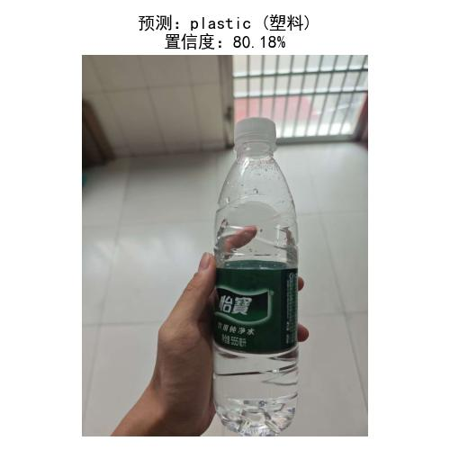

# 实验结果


# 垃圾分类视觉识别系统 🗑️

这是一个基于深度学习的**垃圾分类视觉识别**项目，使用 MobileNet V2 预训练模型进行迁移学习，能够自动识别和分类不同类型的垃圾。

## 📋 项目概述

本项目实现了一个包含以下功能的完整垃圾分类系统：
- ✅ **数据预处理**：图像增强与归一化
- ✅ **模型训练**：使用迁移学习和微调
- ✅ **预测推理**：实时垃圾分类识别
- ✅ **结果可视化**：展示预测结果与置信度

## 🎯 支持的垃圾类别

项目可识别以下 **6 种垃圾类别**：

| 类别编号 | 中文名称 | 英文名称 | 说明 |
|---------|--------|--------|------|
| 0 | 纸板 | Cardboard | 硬纸板、纸箱等 |
| 1 | 玻璃 | Glass | 玻璃瓶、玻璃杯等 |
| 2 | 金属 | Metal | 金属罐、铁皮等 |
| 3 | 纸张 | Paper | 纸张、纸质废弃物 |
| 4 | 塑料 | Plastic | 塑料瓶、塑料袋等 |
| 5 | 其他 | Trash | 其他难以分类的垃圾 |

## 🏗️ 项目结构

```
Garbage-classification/
├── train.py                    # 训练脚本
├── predict.py                  # 预测脚本
├── best_model.pth              # 训练好的模型权重
├── test.jpg                    # 测试用图片
├── result.jpg                  # 预测结果展示
├── garbage-classification/     # 数据集目录（需自行添加）
│   ├── cardboard/
│   ├── glass/
│   ├── metal/
│   ├── paper/
│   ├── plastic/
│   └── trash/
└── README.md                   # 项目说明文档
```

## 🚀 快速开始

### 环境要求

```bash
Python >= 3.8
torch >= 1.9
torchvision >= 0.10
Pillow >= 8.0
matplotlib >= 3.3
```

### 安装依赖

```bash
pip install torch torchvision pillow matplotlib
```

## 📊 模型详情

### 架构说明

- **基础模型**：MobileNet V2（在 ImageNet 数据集上预训练）
- **输入尺寸**：128 × 128 像素
- **输出类别**：6 类
- **优化器**：Adam (lr=0.001)
- **损失函数**：交叉熵损失 (CrossEntropyLoss)

### 训练配置

| 参数 | 值 |
|------|-----|
| 训练轮数 | 10 epochs |
| 批大小 | 16 |
| 训练/验证比例 | 80% / 20% |
| 数据增强 | 随机水平翻转 + 随机旋转 (15°) |

## 🎓 使用指南

### 1️⃣ 训练模型

```bash
python train.py
```

**说明**：
- 脚本会自动加载 `garbage-classification/` 目录中的数据
- 按 80:20 比例自动划分训练/验证集
- 每个 epoch 会打印训练损失和准确率
- 自动保存最优权重到 `best_model.pth`

**输出示例**：
```
类别： ['cardboard', 'glass', 'metal', 'paper', 'plastic', 'trash']
训练集：960 张，验证集：240 张
模型加载完成，开始训练...
Epoch [1/10]  Loss: 1.453  Train Acc: 0.531  Val Acc: 0.604
Epoch [2/10]  Loss: 1.012  Train Acc: 0.677  Val Acc: 0.733
...
训练完成！最优验证准确率：0.854
权重已保存至best_model.pth
```

### 2️⃣ 进行预测

```bash
python predict.py
```

**说明**：
- 默认预测 `test.jpg` 中的垃圾图片
- 输出预测类别和置信度
- 将结果可视化并保存为 `result.jpg`

**输出示例**：
```
预测结果：plastic (塑料)
置信度：95.32%
```

### 3️⃣ 自定义预测

修改 `predict.py` 中的 `img_path` 变量：

```python
img_path = 'your_image.jpg'  # 改为你要预测的图片路径
```

然后运行：
```bash
python predict.py
```

## 📁 数据集准备

如果要重新训练模型，需要按以下结构组织数据集：

```
garbage-classification/
├── cardboard/
│   ├── img1.jpg
│   ├── img2.jpg
│   └── ...
├── glass/
│   ├── img1.jpg
│   └── ...
├── metal/
├── paper/
├── plastic/
└── trash/
```

**数据要求**：
- 图像格式：JPG、PNG 等常见格式
- 最少每类 50-100 张图片
- 图像质量：清晰、光照充足最佳

## 💡 性能指标

根据项目的验证集表现：

| 指标 | 数值 |
|------|-----|
| 最优验证准确率 | ~85.4% |
| 模型文件大小 | ~9.2 MB |
| 单张图片推理时间 | <100ms (CPU) |

## 🔧 核心代码说明

### 数据预处理

```python
# 训练集增强
train_transform = transforms.Compose([
    transforms.Resize((128, 128)),
    transforms.RandomHorizontalFlip(),      # 随机水平翻转
    transforms.RandomRotation(15),          # 随机旋转
    transforms.ToTensor(),
    transforms.Normalize(mean=[0.485, 0.456, 0.406],
                        std=[0.229, 0.224, 0.225])
])
```

### 迁移学习

```python
# 加载预训练模型
model = models.mobilenet_v2(weights='IMAGENET1K_V1')

# 冻结特征提取层
for param in model.features.parameters():
    param.requires_grad = False

# 替换分类头
model.classifier[1] = nn.Linear(model.last_channel, 6)
```

## 📝 文件说明

| 文件名 | 用途 |
|-------|------|
| `train.py` | 模型训练脚本 |
| `predict.py` | 图片预测脚本 |
| `best_model.pth` | 预训练完成的模型权重 |
| `test.jpg` | 示例测试图片 |
| `result.jpg` | 预测结果示例 |

## 🐛 常见问题

**Q: 如何提高准确率？**
- A: 增加训练数据量、调整超参数、增加训练轮数或使用更强大的基础模型（如 ResNet50）

**Q: 预测时出现 CUDA 错误？**
- A: 脚本已默认使用 CPU，无需 GPU。如需 GPU 加速，修改 `device` 设置

**Q: 如何加载自定义的预训练权重？**
- A: 修改 `predict.py` 中的权重路径即可

## 📚 参考资源

- [PyTorch 官方文档](https://pytorch.org)
- [Torchvision 模型库](https://pytorch.org/vision/stable/models.html)
- [MobileNet V2 论文](https://arxiv.org/abs/1801.04381)
